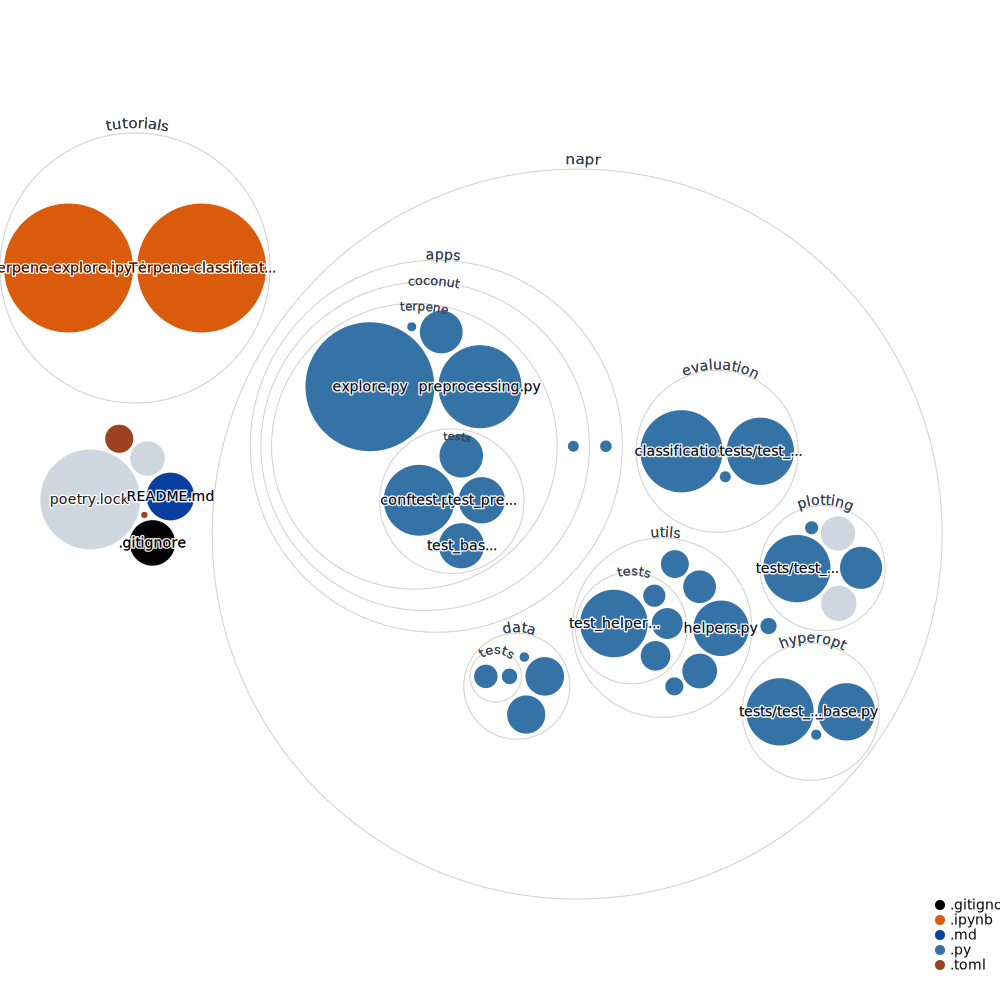

# Napr

[](https://github.com/smortezah/napr/blob/main/LICENSE)
[](https://img.shields.io/pypi/pyversions/napr)
[](https://pypi.org/project/napr)
[](https://codecov.io/gh/smortezah/napr)
[](https://pepy.tech/project/napr)
[](https://github.com/psf/black)
[](https://github.com/smortezah/napr/actions/workflows/ci.yml)

Napr is a Python package that takes a machine learning driven approach to navigate the natural products chemical space.

## Install

```sh
pip install napr
```

To update napr to the latest version, add -U or --upgrade flag, i.e. `pip install -U napr`.

## Tutorials

The tutorials directory include:

- [Terpene-explore](https://github.com/smortezah/napr/tree/main/tutorials/Terpene-explore.ipynb): exploratory data analysis of terpenes (the COCONUT dataset) in the natural products chemical space
- [Terpene-classification-classic](https://github.com/smortezah/napr/tree/main/tutorials/Terpene-classification-classic.ipynb): classification of terpenes with ML techniques such as kNN, random forest and xgboost

## Development

We welcome new contributors of all experience levels.

### Testing

Launch the test suite, after installation:

```sh
pytest napr
```

## Cite

If you use this package, please cite:

- Hosseini, Morteza, and David M. Pereira. "The chemical space of terpenes: insights from data science and AI." arXiv preprint [arXiv:2110.15047](https://arxiv.org/abs/2110.15047) (2021).

## Codebase


